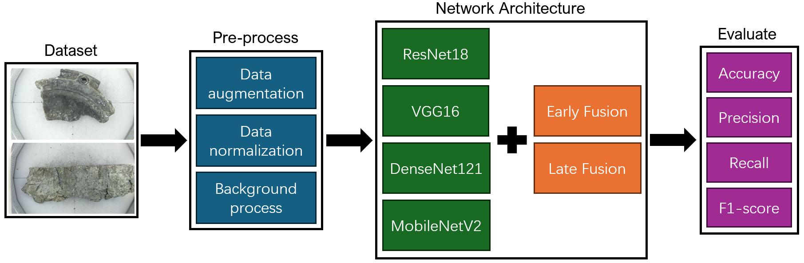

# Classification of Cast and Wrought Aluminium Scrap using Deep Learning and Computer Vision

## 🎓 Master's Dissertation Project
This repository hosts the complete algorithmic framework and experimental pipeline for a **Master's Dissertation Project** conducted within the **Department of Electrical and Electronic Engineering at the University of Manchester**, as part of the **MSc in Advanced Control and Systems Engineering** program.

---

## 🎯 Project Objective & Code Purpose

The core purpose of this codebase is to implement a **purely machine vision-based aluminum alloy classification framework** (separating Cast from Wrought aluminum scrap). By leveraging standard camera feeds instead of high-cost industrial hardware (such as LIBS or XRT spectroscopy), this project delivers a highly scalable, low-cost alternative for automated metal recycling.

To overcome the challenges of irregular metallic shapes and heavy surface reflections, this software pipeline accomplishes two main technical objectives:
1. **Background Decoupling:** Implements classical computer vision preprocessing operators (MOG2 background subtraction, Gaussian blurring, and foreground extraction) to isolate the metallic target from scene noise.
2. **Multi-Stream Feature Fusion:** Introduces and benchmarks **Early Fusion** (channel-level tensor concatenation yielding a 6-channel input layer) and **Late Fusion** (deep representation splicing via dual-backbone feature tracking) paradigms.

The framework provides an automated comparative matrix across four mainstream convolutional backbones: **ResNet18, VGG16, DenseNet121, and MobileNetV2**. Empirical evaluation demonstrates that the proposed multi-stream fusion mechanisms successfully elevate classification accuracy to **over 95%**, proving the robust capacity of vision-driven architectures in heterogeneous industrial sorting environments.

---

## 📊 Methodology Flowchart

Our core approach seamlessly couples classical computer vision algorithms with modern multi-stream neural network architectures to decouple the highly reflective aluminum target from industrial scene backgrounds:



---

## 📁 Repository Structure

The codebase is organized in a self-contained, highly parameterizable single-file execution format to eliminate cross-file import bottlenecks while strictly separating experimental tracking logic:

* `data_processing/` - Directory placeholder for data pipelines.
* `models/` - Directory placeholder for sub-architecture backbones.
* `utils/metrics.py` - Core evaluation engine managing custom `EarlyStopping`, classification statistics, and automated textual reports.
* `train.py` - Unified, robust training pipeline with a centralized global config switch to toggle all 8 fusion/baseline combinations.
* `predict.py` - Single-image production inference tool mirroring training preprocessing logic exactly.
* `requirements.txt` - Python dependency manifest for workspace reproduction.
* `background_sample.png` - Standard reference background frame used for subtraction-based preprocessing variants.

---

## 📂 Dataset Preparation

> 🔒 **Privacy & Proprietary Notice:** Due to industrial nondisclosure agreements and data privacy constraints, the original high-resolution metallic scrap dataset is **not** hosted in this public repository. 

To evaluate or train the models on your own custom dataset, replicate the directory structure below and drop your localized sample images under the `./data/` root:

```text
data/
├── train/
│   ├── Cast_Alu_Images/
│   │   └── [Drop training cast aluminum images here]
│   └── Wrought_Alu_Images/
│       └── [Drop training wrought aluminum images here]
└── test/
    ├── Cast_Alu_Images/
    │   └── [Drop testing cast aluminum images here]
    └── Wrought_Alu_Images/
        └── [Drop testing wrought aluminum images here]
```
---

## ⚡Quick Start

**1.Environment Set Up**
Replicate the precise experimental workspace and verify library versions:
```python
pip install -r requirements.txt
```

**2.Execute Training Pipelines**
Open train.py and modify the global CONFIG dictionary at the very top of the script to toggle your target backbone and fusion paradigm:
```python
CONFIG = {
    'train_data_root': './data/train',
    'test_data_root': './data/test',
    'experiment_mode': 'early',     # Options: 'single' | 'early' | 'late'
    'baseline_bg_mode': 'none',     # Options (for single stream only): 'none' | 'blur' | 'removal'
    'backbone': 'vgg16',            # Options: 'resnet18' | 'vgg16' | 'densenet121' | 'mobilenet_v2'
    ...
}
```
Run the unified script to execute training, validation splitting, checkpoint saving, and test-set inference:
```python
python train.py
```

**3. Production Single Image Inference**
Deploy a localized evaluation loop on a standalone unknownMetallic Scrap snapshot utilizing your saved parameter weights (.pth):
```python
python predict.py
```